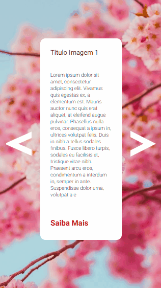

<h1 align="center">
    Carrossel de imagens
</h1>

 

## Versão Desktop 💻
Carrossel de imagens com JavaScript

    

 

## Versão mobile 📱

    

 

## Tecnologias Utilizadas:

✔ HTML

✔ CSS

✔ JAVASCRIPT

